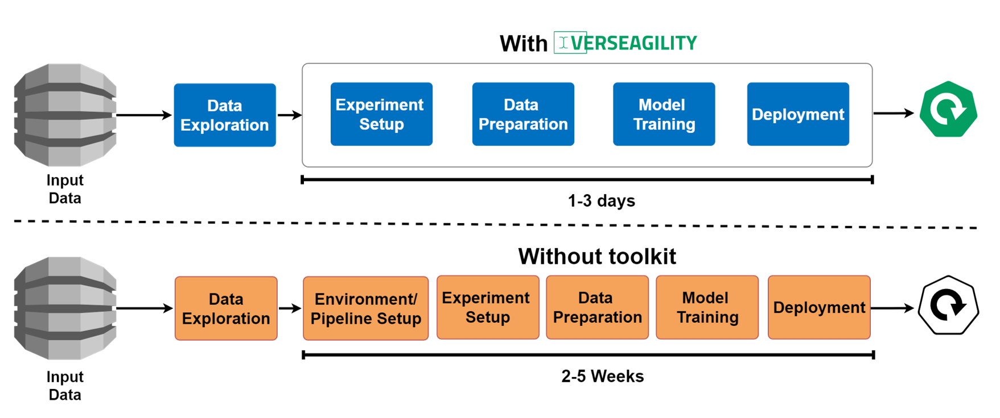
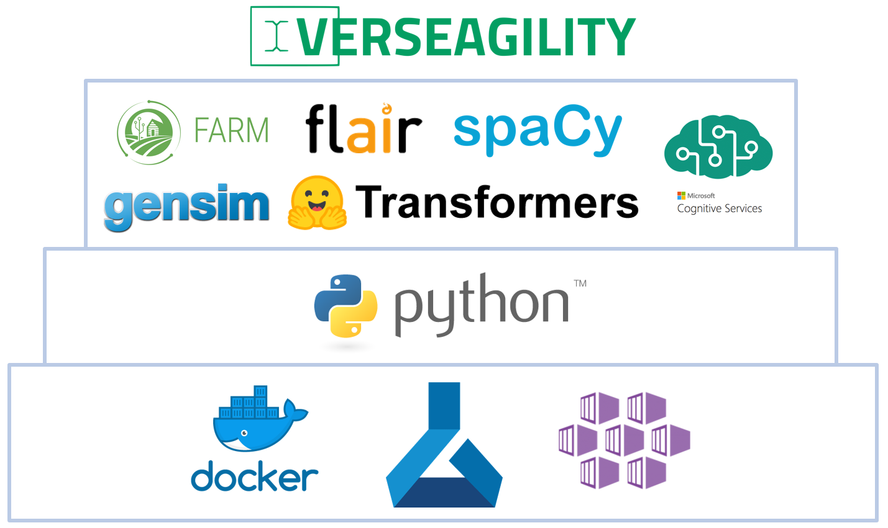

 

# Verseagility - NLP Toolkit
Verseagility is a Python-based toolkit to ramp up your custom natural language processing (NLP) task, allowing you to bring your own data, use your preferred frameworks and bring models into production. It is a central component of the Microsoft Data Science Toolkit.

## Why Verseagility?
Building NLP solutions which cover all components from text classification, named entity recognition to answer suggestion, require testing and integration effort. For this purpose, we developed this toolkit, which serves to minimize the setup time of an end-to-end solution and maximizes the time for use case-specific enhancements and adjustments. On this way, first results should be made available in an accelerated way when bringing individual, pre-labeled text document data and allow more time for iterative improvements. 

See the [documentation section](./docs/README.md) for detailed instructions how to get started with the toolkit.

## Supported Use Cases
Verseagility is a modular toolkit that can be extended by further use-cases as needed. Following use-cases are already implemented and ready to be used:
- Binary, multi-class & multi-label classification
- Named entity recognition
- Question answering
- Opinion mining

## Live Demo
The toolkit paves the way to build consumeable REST APIs, for example in Azure Container Instances. These APIs may be used by the application of your choice: a website, a business process or just for testing purposes.
A web-based live demo of models resulting from Verseagility is hosted at the Microsoft Technology Center Germany (MTC):
> [Verseagility Demo](https://verseagility.azurewebsites.net)

## Repository Structure
The repository is built in the following structure:

    ├── /assets            <- Version controlled assets, such as stopword lists. Max size 
    │                         per file: 10 MB. Training data should
    │                         be stored in local data directory, outside of repository or within gitignore. 
    │
    ├── /demo              <- Demo environment that can be deployed as is, or customized. 
    │
    ├── /deploy            <- Scripts used for deploying training or test service  
    │   ├── training.py    <- Deploy your training to a remote compute instance, via AML
    │   │   
    │   ├── hyperdrive.py  <- Deploy hyperparemeter sweep on a remote compute instance, via AML
    │   │
    │   └── service.py     <- Deploy a service (endpoint) to ACI or AKS, via AML
    │
    ├── /docs              <- Detailed documentation.
    │
    ├── /notebook          <- Jupyter notebooks. Naming convention is <[Task]-[Short Description]>,
    │                         for example: 'Data - Exploration.ipynb'
    │
    ├── /pipeline          <- Document processing pipeline components, including document cracker. 
    │
    ├── /project           <- Project configuration files, detailing the tasks to be completed.
    │
    ├── /scraper           <- Website scraper used to fetch sample data. 
    │                         Can be reused for similarly structured forum websites.
    │
    ├── /src               <- Source code for use in this project.
    │   ├── infer.py       <- Inference file, for scoring the model
    │   │   
    │   ├── data.py        <- Use case agnostic utils file, for data management incl upload/download
    │   │
    │   └── helper.py      <- Use case agnostic utils file, with common functions incl secret handling
    │
    ├── /tests              <- Unit tests (using pytest)
    │
    ├── README.md          <- The top-level README for developers using this project.
    │
    ├── requirements.txt   <- The requirements file for reproducing the analysis environment.
    │                         Can be generated using `pip freeze > requirements.txt`
    │
    └── config.ini         <- Configuration and secrets used while developing locally
                              Secrets in production should be stored in the Azure KeyVault
--------

## Acknowledgements
Verseagility is built in part using the following frameworks:
- [PyTorch](https://pytorch.org/)
- [Transformers](https://github.com/huggingface/pytorch-transformers) by HuggingFace
- [FARM](https://github.com/deepset-ai/FARM/) by deepset ai
- [spaCy](https://github.com/explosion/spaCy/) by Explosion ai
- [flairNLP](https://github.com/flairNLP/flair/) by Humboldt-University of Berlin
- [gensim](https://radimrehurek.com/gensim/)
Azure
- [Text Analytics](https://azure.microsoft.com/en-us/services/cognitive-services/text-analytics/)

See the illustration of our current tech stack below:

## Maintainers:
- [Timm Walz](mailto:timm.walz@microsoft.com)
- [Christian Vorhemus](mailto:christian.vorhemus@microsoft.com)
- [Martin Kayser](https://www.linkedin.com/in/mkayser/)

## Current updates
The following section contains a list of possible new features or enhancements. Feel free to contribute. 
### Infrastructure
- [ ] Verseagility Lite template (ARM)
- [ ] Python Version >= 3.7 support (Transformers dependencies)
- [ ] Upgrade to newer AzureML SDK
### Datasets
- [ ] Support if tabular data sets in AML
### Classification
- [ ] Integrate handling for larger documents vs short documents
- [ ] Integrate explicit handling for unbalanced datasets
- [ ] ONNX support
### NER
- [ ] Improve duplicate handling
- [x] Opinion Mining API
- [ ] New Text Analytics API version
### Question Answering
- [ ] Apply advanced IR methods
### Summarization
- [ ] **(IP)** full test of integration
### Deployment
- [ ] Deploy service to Azure Function (without AzureML)
- [ ] Setup GitHub actions
- [ ] AKS testing
### Notebooks Templates
- [ ] **(IP)** review model results (auto generate after each training step)
- [ ] Review model bias (auto generate after each training step)
- [ ] **(IP)** available models benchmark (incl AutoML)
### Tests
- [ ] Unit tests (pytest)

## Contributing
This project welcomes contributions and suggestions.  Most contributions require you to agree to a
Contributor License Agreement (CLA) declaring that you have the right to, and actually do, grant us
the rights to use your contribution. For details, visit https://cla.opensource.microsoft.com.

When you submit a pull request, a CLA bot will automatically determine whether you need to provide
a CLA and decorate the PR appropriately (e.g., status check, comment). Simply follow the instructions
provided by the bot. You will only need to do this once across all repos using our CLA.

This project has adopted the [Microsoft Open Source Code of Conduct](https://opensource.microsoft.com/codeofconduct/).
For more information see the [Code of Conduct FAQ](https://opensource.microsoft.com/codeofconduct/faq/) or
contact [opencode@microsoft.com](mailto:opencode@microsoft.com) with any additional questions or comments.

**Feel free to contribute!**
